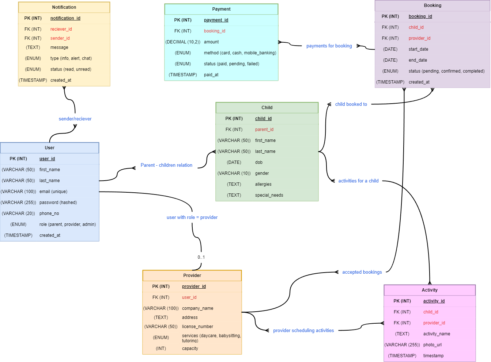

# CuddleCare Database Schema

## Overview
This schema defines the database structure for **CuddleCare**, a childcare booking system that connects parents/guardians with childcare providers. It supports user roles, child registration, bookings, activity updates, health records, payments, and communication.

---
## Entities

### 1, Users
### 2, Children
### 3, Provider
### 4, Bookings
### 5, Activities/Updates
### 6, Payments
### 7, Notifications/Messages

## Tables

### 1. Users
| Column         | Type        | Constraints                  |
|----------------|-------------|------------------------------|
| user_id        | INT (PK)    | AUTO INCREMENT               |
| full_name      | VARCHAR     | NOT NULL                     |
| email          | VARCHAR     | UNIQUE, NOT NULL             |
| password_hash  | VARCHAR     | NOT NULL                     |
| phone          | VARCHAR     | NULL                         |
| role           | ENUM        | ('parent','provider','admin')|
| created_at     | TIMESTAMP   | DEFAULT CURRENT_TIMESTAMP    |

---

### 2. Children
| Column        | Type      | Constraints                           |
|---------------|-----------|---------------------------------------|
| child_id      | INT (PK)  | AUTO INCREMENT                        |
| parent_id     | INT (FK)  | REFERENCES Users(user_id)             |
| full_name     | VARCHAR   | NOT NULL                              |
| dob           | DATE      | NOT NULL                              |
| gender        | ENUM      | ('male','female','other')             |
| allergies     | TEXT      | NULL                                  |
| special_needs | TEXT      | NULL                                  |

---

### 3. Providers
| Column         | Type      | Constraints                           |
|----------------|-----------|---------------------------------------|
| provider_id    | INT (PK)  | AUTO INCREMENT                        |
| user_id        | INT (FK)  | REFERENCES Users(user_id)             |
| company_name   | VARCHAR   | NOT NULL                              |
| address        | VARCHAR   | NOT NULL                              |
| license_number | VARCHAR   | UNIQUE                                |
| services       | VARCHAR   | (daycare, babysitting, tutoring)      |
| capacity       | INT       | NULL                                  |
| approval_status| ENUM      | ('Approved', 'Rejected', 'Pending')   |

---

### 4. Bookings
| Column       | Type      | Constraints                            |
|--------------|-----------|----------------------------------------|
| booking_id   | INT (PK)  | AUTO INCREMENT                         |
| child_id     | INT (FK)  | REFERENCES Children(child_id)          |
| provider_id  | INT (FK)  | REFERENCES Providers(provider_id)      |
| start_date   | DATE      | NOT NULL                               |
| end_date     | DATE      | NULL                                   |
| status       | ENUM      | ('pending','confirmed','cancelled')    |
| created_at   | TIMESTAMP | DEFAULT CURRENT_TIMESTAMP              |

---

### 5. Activities
| Column       | Type      | Constraints                                     |
|--------------|-----------|-------------------------------------------------|
| activity_id  | INT (PK)  | AUTO INCREMENT                                  |
| child_id     | INT (FK)  | REFERENCES Children(child_id)                   |
| provider_id  | INT (FK)  | REFERENCES Providers(provider_id)               |
| activity_type| ENUM      | ('nap','meal','play','assignment','fun_moment') |
| description  | TEXT      | NULL                                            |
| photo_url    | VARCHAR   | NULL                                            |
| timestamp    | TIMESTAMP | DEFAULT CURRENT_TIMESTAMP                       |

---

### 6. Payments
| Column       | Type      | Constraints                            |
|--------------|-----------|----------------------------------------|
| payment_id   | INT (PK)  | AUTO INCREMENT                         |
| booking_id   | INT (FK)  | REFERENCES Bookings(booking_id)        |
| amount       | DECIMAL   | NOT NULL                               |
| method       | ENUM      | ('card','cash','mobile_money')         |
| status       | ENUM      | ('paid','pending','failed')            |
| paid_at      | TIMESTAMP | NULL                                   |

---

### 7. Notifications
| Column        | Type      | Constraints                            |
|---------------|-----------|----------------------------------------|
| notification_id| INT (PK) | AUTO INCREMENT                         |
| receiver_id   | INT (FK)  | REFERENCES Users(user_id)              |
| sender_id     | INT (FK)  | REFERENCES Users(user_id)              |
| message       | TEXT      | NOT NULL                               |
| type          | ENUM      | ('info','alert','chat')                |
| status        | ENUM      | ('read','unread')                      |
| created_at    | TIMESTAMP | DEFAULT CURRENT_TIMESTAMP              |

---

## Relationships
- **Users → Children**: 1-to-many  
- **Users → Providers**: 1-to-1 (provider must be a user)  
- **Children → Bookings**: 1-to-many  
- **Providers → Bookings**: 1-to-many  
- **Bookings → Payments**: 1-to-many  
- **Children → Activities**: 1-to-many  
- **Users → Notifications**: sender/receiver  

# CuddleCare ER Diagram

