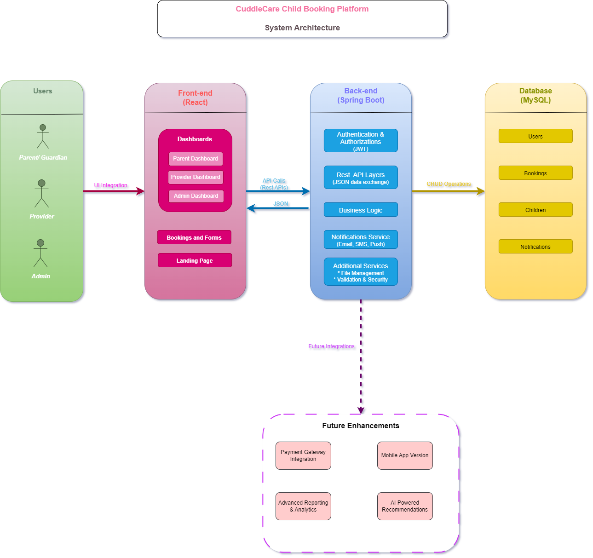

# Design Document
## CuddleCare Childcare Booking System — System Architecture

### Overview
This document describes the system architecture for **CuddleCare**, a childcare booking platform that connects parents/guardians with childcare providers. The design ensures scalability, maintainability, and security while providing a smooth user experience for all stakeholders.

---

### 1. Users
The system serves three main user roles:
- **Parent/Guardian**: Registers children, views childcare providers, makes bookings, and tracks updates.
- **Childcare Provider**: Manages service listings, accepts bookings, and updates availability.
- **Admin**: Oversees platform activities, manages users and bookings, and handles system settings.

---

### 2. Frontend (React)
The frontend is designed for **responsiveness, accessibility, and usability**. It includes:
- **Landing Page**: General system introduction and access to signup/login.
- **Bookings & Forms**: Interfaces for parents to book childcare services and providers to manage requests.
- **Dashboards**:
  - Parent Dashboard
  - Provider Dashboard
  - Admin Dashboard

**Key Features:**
- Role-based access to specific dashboards.
- Dynamic updates via API calls.
- Responsive design for desktop and mobile devices.

---

### 3. Backend (PHP/MySQL or Spring Boot)
The backend provides a **secure, scalable, and maintainable** foundation for the system. Components include:
- **Authentication & Authorization**: JWT and Role-based Access Control for secure login and access.
- **REST API Layer**: JSON-based communication between frontend and backend.
- **Business Logic**: Core system rules for bookings, notifications, and user management.
- **Notifications Service**: Sends real-time updates to users via Email, SMS, or Push notifications.

---

### 4. Database (MySQL)
The relational database stores system data in the following tables:
- **Users Table**: Stores user account information, roles, and authentication data.
- **Children Table**: Stores children’s profiles linked to parents/guardians.
- **Bookings Table**: Stores booking details, status, and timestamps.
- **Notifications Table**: Stores notifications for tracking and history.
- **Providers**: Stores providers informations, services they give, and their approval status
- **Activities**: Stores activities that the children may do in a given day
- **Payments**: Stores information about payments whether it is paid, or pending or failed.

---

### 5. System Interaction Flow
**Connections:**
- **Users → Frontend**: UI interaction through web browsers.
- **Frontend ↔ Backend**: API calls exchanging JSON data.
- **Backend ↔ Database**: CRUD operations to manage data.
- **Backend → Notifications Service**: Sends updates via Email, SMS, and Push notifications.

**Diagram Legend:**
- Solid arrows for direct interactions.
- Dashed arrows for planned future integrations.

---

### 6. Future Enhancements
The system is designed with scalability in mind. Planned enhancements include:
- Payment Gateway Integration for secure online transactions.
- Cloud Hosting & Load Balancer for performance optimization.
- Advanced Reporting & Analytics for admin insights.
- Mobile App (React Native / Flutter) for broader accessibility.

---

### 7. System Architecture Diagram
The following diagram illustrates the system components and their interactions.

*Figure: System architecture for CuddleCare Childcare Booking System.*
